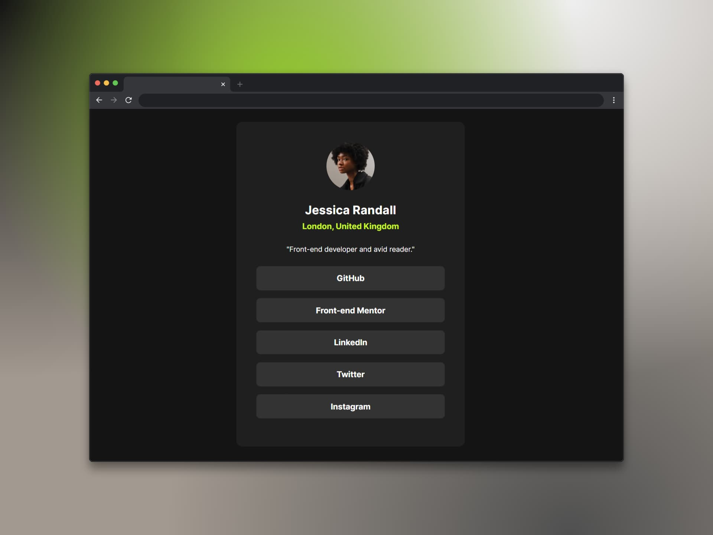

# Perfil de enlaces sociales (Social links profile)

Un perfil de enlaces sociales, o social links profile, es una herramienta que permite **organizar y presentar enlaces a diferentes perfiles de redes sociales de una persona o entidad en un solo lugar**. La idea de este perfil de enlaces es facilitar que otros encuentren y accedan a tus perfiles en diferentes plataformas, como GitHub, Facebook, Instagram, Twitter, LinkedIn, YouTube, Twitch, etc., desde un único punto. Además, un perfil de enlaces sociales puede ayudar a mejorar la visibilidad y credibilidad online ya que demuestra una presencia más completa y profesional; del mismo modo, también puede ayudar a dirigir tráfico a diferentes páginas web o contenidos específicos ya que permite un acceso rápido y sencillo mejorando así la experiencia de usuario. 

## Tecnologías usadas

- HTML
- Tailwind CSS

[Ver app🔗](https://seandsun.github.io/monorepo-zero-html-css/02-social-links-profile-main/dist/)

  Challenge by <a href="https://www.frontendmentor.io?ref=challenge" target="_blank">Frontend Mentor</a>. 
  Coded by <a href="https://github.com/seandsun">Seandsun</a>.

 <h3 align="center">< seandsun /></h3>