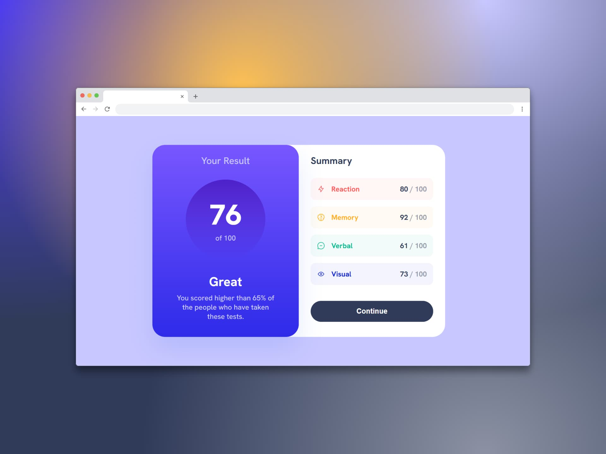

# Componente de resumen de resultados - (Results summary component)

Un resumen de resultados sirve para **presentar** de manera clara y concisa los **hallazgos clave** de un estudio, investigación, encuesta o análisis. Su propósito principal es **informar** al lector sobre los resultados obtenidos, sin interpretaciones ni conclusiones subjetivas, permitiéndole comprender rápidamente los datos y su significado.

Un resumen de resultados es importante para los usuarios porque:

- Facilita la comprensión.
- Destaca la información clave.
- Apoya la toma de decisiones.
- Ahorra tiempo.
- Mejora la experiencia del usuario.

## Tecnologías usadas

- HTML
- CSS

[Ver app🔗](https://)

  Challenge by <a href="https://www.frontendmentor.io?ref=challenge" target="_blank">Frontend Mentor</a>. 
  Coded by <a href="https://github.com/seandsun">Seandsun</a>.

 <h3 align="center">< seandsun /></h3>