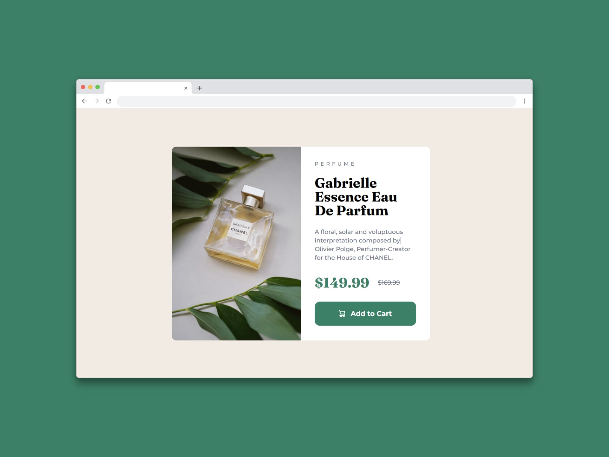

# Componente de tarjeta de vista previa del producto - (Product preview card component)

Un componente de tarjeta de vista previa de producto o Product Preview Card Component, sirve para **mostrar de forma atractiva y concisa la información de un producto o servicio**, permitiendo a los usuarios interactuar con él de manera visual. Es importante porque mejora la experiencia del usuario al presentar los productos de forma atractiva y fácil de entender, lo que puede aumentar el interés y la probabilidad de compra. 

Un componente de tarjeta de vista previa de producto es útil por que:

- Facilita la creación de tarjetas que son visualmente atractivas ya que pueden tener imágenes, títulos, descripciones y posibles precios o botones de llamada a la acción o call to action.
- Estimula la interacción del usuario ya que permiten explorar rápidamente los detalles del producto sin tener que abandonar la página principal.
- Mejora la experiencia del usuario (UX) ya que puede hacer que la navegación por el sitio web sea más intuitiva y agradable.
- Aumenta las conversiones debido a que se presenta la información de manera concisa y atractiva, lo cual facilita la toma de decisiones por parte del cliente.
- Flexibiliza la personalización debiado a que muchos componentes de tarjetas de vista previa son personalizables, lo que permite a los desarrolladores adaptarlos a las necesidades específicas de su marca y producto, lo cual ahorra tiempo y esfuerzo en desarrollo y permite su reutilización en diferentes partes del sitio web o app.

## Tecnologías usadas

- HTML
- Tailwind CSS

[Ver app🔗](https://seandsun.github.io/monorepo-zero-html-css/06-product-preview-card-component-main/dist/)

  Challenge by <a href="https://www.frontendmentor.io?ref=challenge" target="_blank">Frontend Mentor</a>. 
  Coded by <a href="https://github.com/seandsun">Seandsun</a>.

 <h3 align="center">< seandsun /></h3>