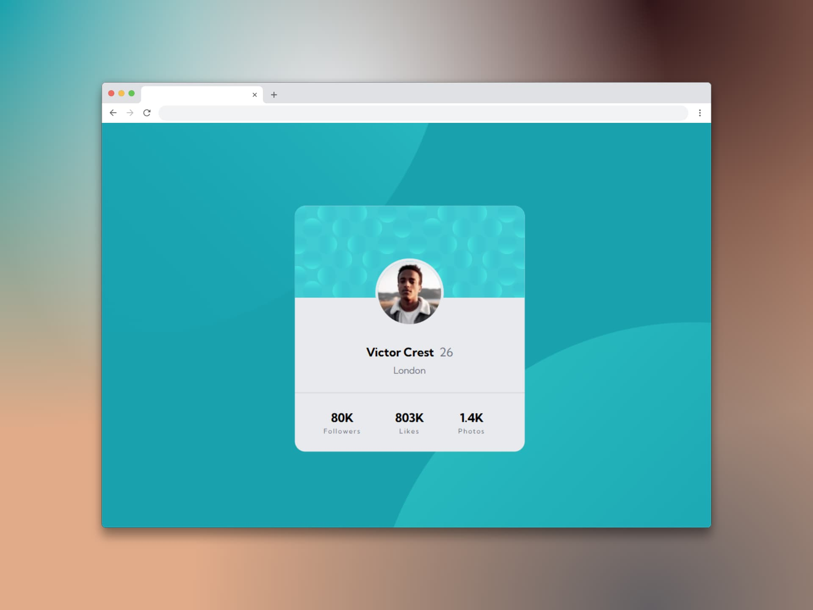

# Componente de tarjeta de perfil (Profile card component)

Un componente de tarjeta de perfil sirve para **presentar de manera visual y organizada información clave de un usuario o persona en una interfaz digital**. Es una forma concisa de mostrar datos relevantes como nombre, foto, cargo, detalles de contacto, y a veces, información adicional sobre sus intereses, estudios o habilidades.

## Tecnologías usadas

- HTML
- Tailwind CSS

[Ver app🔗](https://seandsun.github.io/monorepo-zero-html-css/11-profile-card-component-main/dist/)

  Challenge by <a href="https://www.frontendmentor.io?ref=challenge" target="_blank">Frontend Mentor</a>. 
  Coded by <a href="https://github.com/seandsun">Seandsun</a>.

 <h3 align="center">< seandsun /></h3>
