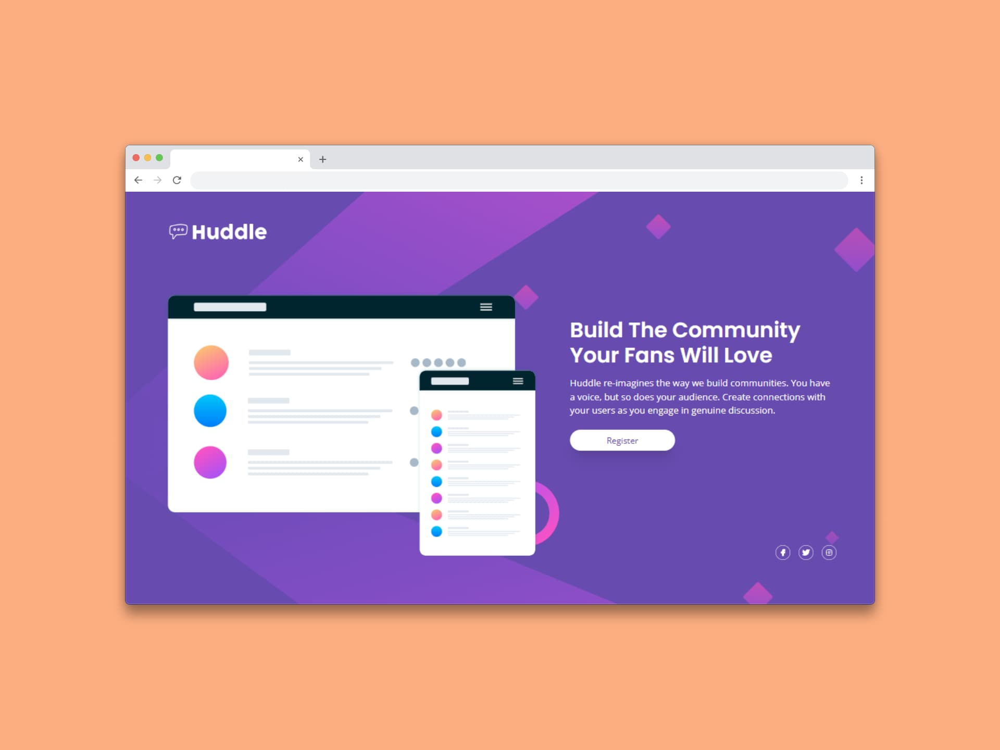

# Página de inicio de Huddle con una única sección introductoria (Huddle landing page with single introductory section)

Una página de inicio con una única sección introductoria **sirve principalmente para presentar de forma concisa y clara el propósito de la plataforma o servicio (Huddle), destacando sus beneficios clave y motivando a los usuarios a explorar más**. En esencia, es una tarjeta de presentación digital que busca captar la atención del usuario y dirigirlo a las secciones o funcionalidades más importantes.

La página de inicio con su única sección introductoria, tiene como objetivo principal:

1. **Captar la atención del usuario:** la sección introductoria debe ser atractiva y llamativa, utilizando un titular impactante y un breve texto que resuma la propuesta de valor de Huddle. 
2. **Explicar qué es Huddle:** la página debe dejar claro qué es Huddle y para qué sirve, evitando confusiones y aclarando su función principal.
3. **Destacar los beneficios:** se deben resaltar los principales beneficios que Huddle ofrece a los usuarios.
4. **Guiar al usuario:** la sección introductoria debe incluir un llamado a la acción claro y conciso, que impulse al usuario a explorar más la página o a registrarse si es necesario. 
5. **Generar confianza:** una página de inicio bien diseñada y con información clara puede generar confianza en el usuario y animarlo a interactuar con la plataforma. 

Ejemplos concretos de uso:

- **Página de inicio de un servicio de videoconferencias:** la sección introductoria podría destacar la facilidad de uso, la calidad de audio y video, y la posibilidad de realizar reuniones desde cualquier lugar. 
- **Página de inicio de un software de colaboración:** la sección podría enfocarse en la eficiencia en la gestión de proyectos, la mejora de la comunicación entre equipos y la facilidad de acceso a la información. 
- **Página de inicio de una plataforma de aprendizaje en línea:** la sección podría resaltar la flexibilidad del aprendizaje, la calidad de los contenidos y la posibilidad de interactuar con otros estudiantes. 

En resumen, la página de inicio con una única sección introductoria es una herramienta poderosa para la comunicación y la captación de usuarios, siempre y cuando se diseñe de manera efectiva y se utilicen los elementos adecuados para transmitir la propuesta de valor de la plataforma.

## Tecnologías usadas

- HTML
- Tailwind CSS

[Ver app🔗](https://seandsun.github.io/monorepo-zero-html-css/13-huddle-landing-page-with-single-introductory-section-main/dist/)

  Challenge by <a href="https://www.frontendmentor.io?ref=challenge" target="_blank">Frontend Mentor</a>. 
  Coded by <a href="https://github.com/seandsun">Seandsun</a>.

 <h3 align="center">< seandsun /></h3>
